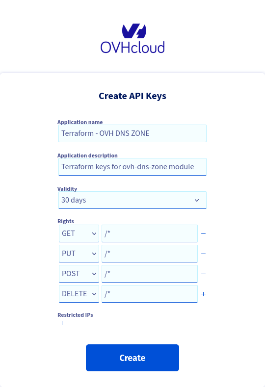
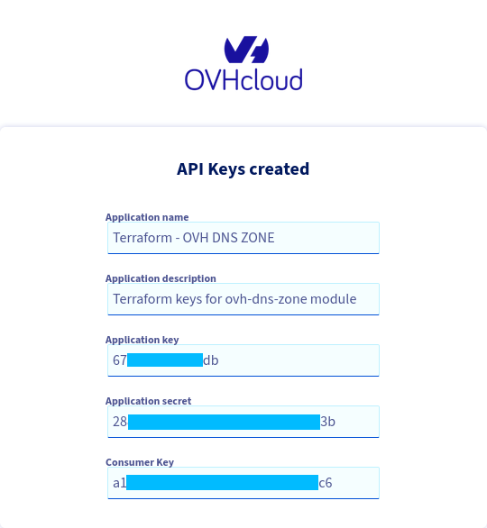

# OVH DNS zone sample

Useful links:

| Descrption                      | Link                                                             |
|---------------------------------|------------------------------------------------------------------|
| Provider documentation          | https://registry.terraform.io/providers/ovh/ovh/latest           |
| OVH Cloud token generation page | https://api.ovh.com/createToken/?GET=/*&POST=/*&PUT=/*&DELETE=/* |

## Pre-requisites

* An OVH Cloud Account
* API Key Credentials (see _Getting credentials_ step)
* An existing DNS Zone to manage in OVH Cloud

## Getting credentials

Credentials car be generated using the OVH Cloud token generation
page : https://api.ovh.com/createToken/?GET=/*&POST=/*&PUT=/*&DELETE=/*



Take note of the generated Application Key, Application secret and Consumer Keys :



## Required env vars

This project needs 3 environment variables in order to be run :

| env                    | value                                                 |
|------------------------|-------------------------------------------------------|
| OVH_APPLICATION_KEY    | The Application Key generated at the previous step    |
| OVH_APPLICATION_SECRET | The Application Secret generated at the previous step |
| OVH_CONSUMER_KEY       | The Consumer Key generated at the previous step       |

## Running the code

This code manages a DNS Zone that I own.

In order to use this code to manage your own zone, set the value of the `zone_name` variable, and update the `main.tf`
file to set your own records.

This code can be run using the commande `terraform apply` :

```shell
$ terraform apply
data.ovh_domain_zone.zone: Reading...
data.ovh_domain_zone.zone: Read complete after 0s

Terraform used the selected providers to generate the following execution plan. Resource actions are indicated with the following symbols:
  + create

Terraform will perform the following actions:

  # ovh_domain_zone_record.dagobah will be created
  + resource "ovh_domain_zone_record" "dagobah" {
      + fieldtype = "A"
      + id        = (known after apply)
      + subdomain = "dagobah"
      + target    = "47.41.108.60"
      + ttl       = 60
      + zone      = "star-wars.ovh"
    }

  # ovh_domain_zone_record.tatooine will be created
  + resource "ovh_domain_zone_record" "tatooine" {
      + fieldtype = "A"
      + id        = (known after apply)
      + subdomain = "tatooine"
      + target    = "242.105.108.11"
      + ttl       = 60
      + zone      = "star-wars.ovh"
    }

Plan: 2 to add, 0 to change, 0 to destroy.

Do you want to perform these actions?
  Terraform will perform the actions described above.
  Only 'yes' will be accepted to approve.

  Enter a value: yes

ovh_domain_zone_record.tatooine: Creating...
ovh_domain_zone_record.dagobah: Creating...
ovh_domain_zone_record.tatooine: Creation complete after 0s
ovh_domain_zone_record.dagobah: Creation complete after 0s

Apply complete! Resources: 2 added, 0 changed, 0 destroyed.
```
